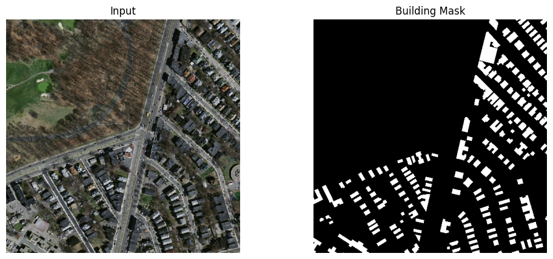
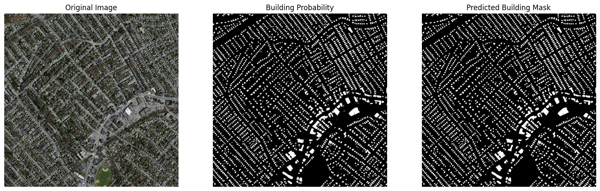
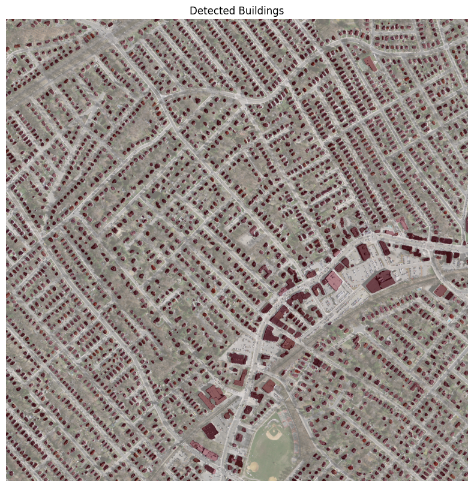
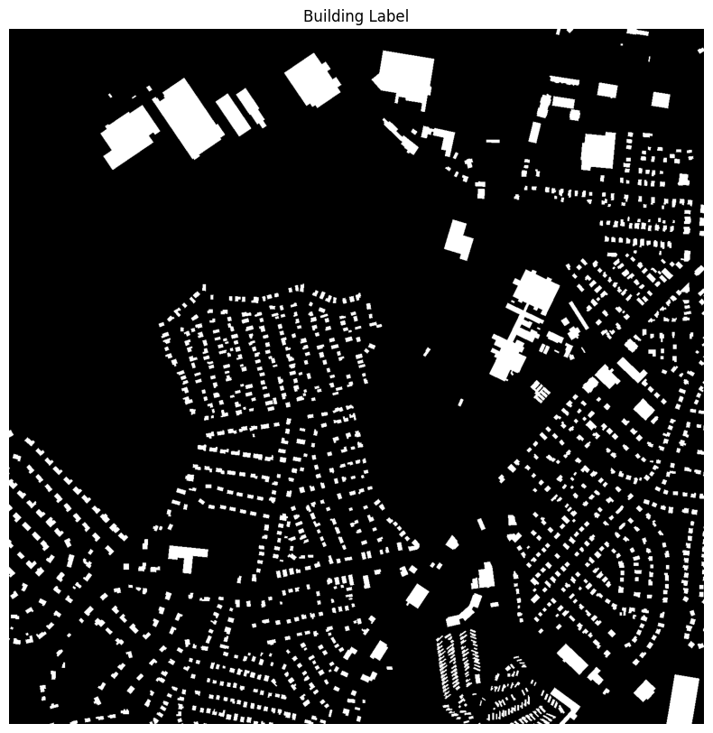
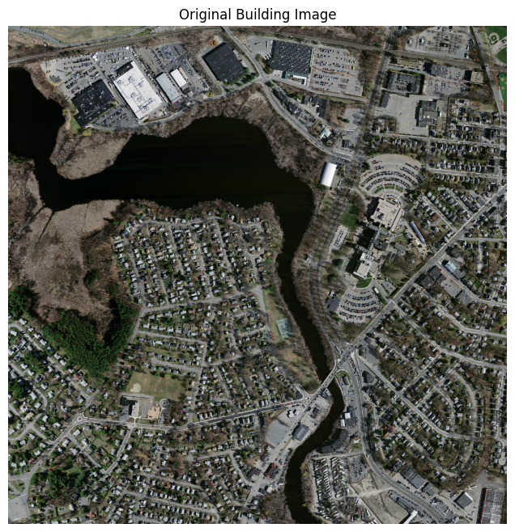
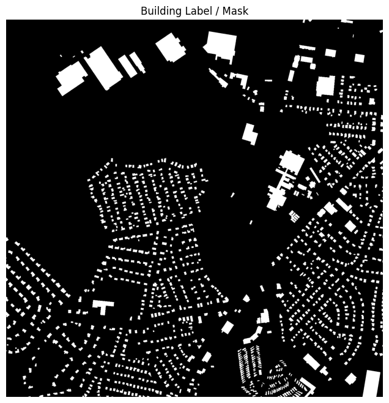
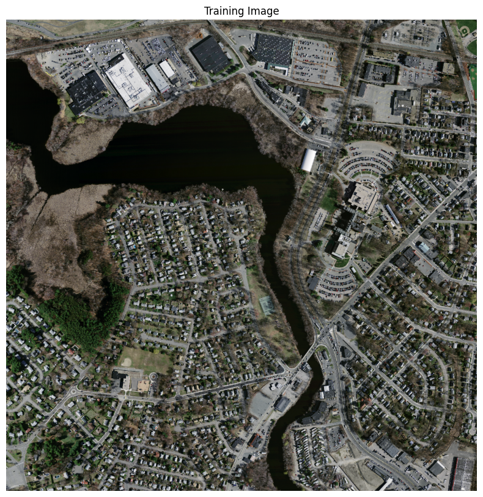

# 🏠 Building Detection and Counting Using Satellite Imagery

A deep learning-based system for **building detection, semantic segmentation, and automated building counting** from high-resolution aerial imagery.

The project uses a **U-Net segmentation architecture with a ResNet34 encoder** to generate pixel-level building masks. The predicted masks are then processed using **thresholding and connected-component analysis** to identify individual building regions and estimate the total number of buildings.


## 📌 Project Overview

Manually identifying and counting buildings from high-resolution aerial imagery can be time-consuming, especially across large areas.

This project develops an automated pipeline that:

- Processes high-resolution aerial imagery
- Generates building segmentation masks
- Detects building regions using a U-Net model
- Applies thresholding to obtain binary building masks
- Uses connected-component analysis to identify individual buildings
- Calculates the predicted building count
- Compares predicted counts with ground-truth counts
- Evaluates both segmentation and counting performance

---

## 🎯 Objectives

The main objectives of this project are:

1. Detect buildings from aerial imagery using deep learning.
2. Generate pixel-level building segmentation masks.
3. Convert segmentation predictions into individual building regions.
4. Automatically count detected buildings.
5. Evaluate segmentation quality using Dice, IoU, Precision, and Recall.
6. Evaluate counting accuracy using MAE and RMSE.
7. Develop a reproducible pipeline that can be extended to larger geographical areas.

---

## 🗂️ Dataset

The project uses high-resolution aerial imagery stored as GeoTIFF files with corresponding building-label masks.

### Image Characteristics

- Image size: **1500 × 1500 pixels**
- Image channels: **3 RGB bands**
- Image data type: **uint8**
- Pixel range: **0–255**
- Building labels: binary masks
- Label values:
  - `0` → Background
  - `255` → Building

The notebook organizes the data into:

```text
tiff/
├── train/
├── train_labels/
├── val/
├── val_labels/
├── test/
└── test_labels/
````

The complete dataset is **not included in this repository** because of its size.

The notebook expects the dataset to be available through Google Drive when executed in Google Colab.

---

## 🔄 Project Workflow

```text
High-Resolution Aerial Image
            │
            ▼
     Data Preparation
            │
            ▼
      512 × 512 Crops
            │
            ▼
    U-Net + ResNet34
            │
            ▼
   Building Probability Map
            │
            ▼
     Threshold = 0.60
            │
            ▼
    Binary Building Mask
            │
            ▼
 Connected-Component Analysis
            │
            ▼
   Remove Regions < 5 Pixels
            │
            ▼
     Building Count
            │
            ▼
 Compare with Ground Truth
            │
            ▼
      MAE / RMSE
```

---

## 🧹 Data Preparation

Large 1500 × 1500 aerial images are divided into smaller **512 × 512 pixel crops** for model training.

The preprocessing pipeline includes:

* Reading GeoTIFF images using Rasterio
* Converting image arrays into RGB format
* Normalizing pixel values using `image / 255.0`
* Randomly cropping images into 512 × 512 patches
* Converting building labels into binary masks
* Converting images and masks into PyTorch tensors

### Training and Validation Samples

| Dataset    |   Samples |
| ---------- | --------: |
| Training   | **1,050** |
| Validation |    **20** |

A batch size of **4** is used during training.

---

## 🧠 Model Architecture

The project uses:

### U-Net

U-Net is a semantic segmentation architecture designed to perform pixel-level image segmentation.

### ResNet34 Encoder

The U-Net encoder uses **ResNet34** with **ImageNet-pretrained weights**.

Model configuration:

```text
Architecture: U-Net
Encoder: ResNet34
Encoder Weights: ImageNet
Input Channels: 3
Output Classes: 1
Activation: Raw logits
```

The model uses the available GPU when CUDA is available.

---

## ⚙️ Training Configuration

The model is trained for **20 epochs**.

### Loss Function

A combined Dice + Binary Cross-Entropy loss is used:

```text
Total Loss =
0.5 × Dice Loss
+
0.5 × BCE Loss
```

This combines:

* Region-overlap learning through Dice Loss
* Pixel-level classification through BCE Loss

### Optimizer

```text
Optimizer: AdamW
Learning Rate: 0.0001
Weight Decay: 0.0001
Batch Size: 4
Epochs: 20
```

---

## 🏠 Building Detection and Counting

After segmentation, the model produces a probability map representing the confidence that each pixel belongs to a building.

The final counting configuration was selected using the validation data.

### Selected Parameters

| Parameter              |        Value |
| ---------------------- | -----------: |
| Probability Threshold  |     **0.60** |
| Minimum Component Area | **5 pixels** |
| Validation MAE         |    **43.75** |
| Validation RMSE        |    **50.67** |

### Counting Process

```text
Probability Map
      │
      ▼
Threshold = 0.60
      │
      ▼
Binary Building Mask
      │
      ▼
Connected Components
      │
      ▼
Remove Regions < 5 Pixels
      │
      ▼
Detected Buildings
      │
      ▼
Total Building Count
```

Each remaining connected component is treated as a detected building.

---

# 📊 Model Performance

The project evaluates the model at two levels:

### 1. Segmentation Performance

| Metric     |      Score |
| ---------- | ---------: |
| Dice Score | **0.8156** |
| IoU        | **0.6892** |
| Precision  | **0.8325** |
| Recall     | **0.8002** |

### 2. Building Counting Performance

Final evaluation on the test dataset:

| Metric                |               Result |
| --------------------- | -------------------: |
| MAE                   |  **91.70 buildings** |
| RMSE                  | **113.64 buildings** |
| Probability Threshold |             **0.60** |
| Minimum Area          |         **5 pixels** |

> The counting parameters were selected using the validation dataset and then kept fixed for the final test evaluation.

---

## 📈 Example Counting Results

Some examples from the final test evaluation:

| Test Image         | Actual Count | Predicted Count | Absolute Error |
| ------------------ | -----------: | --------------: | -------------: |
| `22828930_15.tiff` |         3000 |            2848 |            152 |
| `22828990_15.tiff` |         1213 |            1220 |              7 |
| `22829050_15.tiff` |         1129 |            1121 |              8 |

These examples demonstrate how the system converts pixel-level segmentation into numerical building counts.

---

# 🖼️ Visual Results

## Training Image and Building Mask



The image shows an aerial input image alongside its corresponding building mask.

---

## Model Prediction



This visualization shows the original image, predicted building probability map, and binary building prediction.

---

## Detected Building Overlay



The predicted building regions are displayed over the original aerial imagery.

---

## Building Label



Ground-truth building-label visualization used during the data preparation process.

---

## Original Building Image



Example aerial imagery used in the building detection pipeline.

---

## Building Label Mask



Binary representation of the building-label data.

---

## Training Image



Example input image used during model training.

---

# 🛠️ Technologies Used

### Programming

* Python

### Deep Learning

* PyTorch
* Segmentation Models PyTorch
* U-Net
* ResNet34

### Computer Vision & Image Processing

* Rasterio
* NumPy
* OpenCV
* Matplotlib

### Development Environment

* Google Colab
* Google Drive
* CUDA / GPU

---

# 📁 Repository Structure

```text
building-counting-detection/
│
├── images/
│   ├── building_label.png
│   ├── building_label_mask.png
│   ├── detected_buildings_overlay.png
│   ├── model_prediction.png
│   ├── original_building_image.png
│   ├── training_image.png
│   └── training_image_and_mask.png
│
├── Building_Counting_Detection.ipynb
│
├── README.md
│
└── requirements.txt
```

---

# ▶️ How to Run

## 1. Open the Notebook

Open:

```text
Building_Counting_Detection.ipynb
```

using Google Colab.

## 2. Prepare Google Drive

The notebook expects the project dataset to be available in:

```text
/content/drive/MyDrive/Building_Counting_Project1/
```

with the following structure:

```text
Building_Counting_Project1/
└── tiff/
    ├── train/
    ├── train_labels/
    ├── val/
    ├── val_labels/
    ├── test/
    └── test_labels/
```

## 3. Install Required Libraries

Install the required Python packages:

```bash
pip install rasterio segmentation-models-pytorch torch torchvision opencv-python matplotlib numpy pandas tqdm
```

## 4. Run the Notebook

Run the notebook cells sequentially.

The notebook performs:

```text
Dataset Verification
        ↓
Image Preprocessing
        ↓
Dataset Creation
        ↓
U-Net Construction
        ↓
Model Training
        ↓
Segmentation Evaluation
        ↓
Counting Parameter Tuning
        ↓
Test Prediction
        ↓
Building Counting
        ↓
Final Evaluation
```

---

# ⚠️ Limitations

The current implementation has several limitations:

* The counting system relies on connected components after semantic segmentation.
* Touching buildings may sometimes be detected as a single connected region.
* Fragmented predictions can potentially produce multiple components for one building.
* The model was evaluated on a limited test set.
* The dataset may not represent every possible geographic region, building type, or environmental condition.
* Counting performance can therefore vary across different imagery conditions.

---

# 🚀 Future Improvements

Potential improvements include:

### 🌍 Larger and More Diverse Datasets

Train the model using aerial imagery from more cities, regions, seasons, and environmental conditions.

### 🏘️ Improved Building Separation

Investigate instance-segmentation approaches such as:

* Mask R-CNN
* U-Net++
* Instance-aware segmentation methods

These approaches could help separate adjacent buildings.

### 🧠 Advanced Architectures

Future experiments could compare the current U-Net + ResNet34 approach with:

* U-Net++
* DeepLab
* SegFormer
* Transformer-based segmentation models

### 🔄 Data Augmentation

Additional augmentation could include:

* Rotation
* Horizontal flipping
* Vertical flipping
* Scaling
* Brightness variation
* Contrast variation

### 🗺️ Large-Area Processing

Very large aerial images could be divided into tiles, processed individually, and combined to create building inventories over larger geographical areas.

### 🌐 GIS Integration

Predicted building boundaries could be converted into geospatial vector formats and integrated with GIS applications for spatial analysis.

### 📊 More Comprehensive Evaluation

Future experiments could include:

* F1-score
* Average Precision
* Counting accuracy
* Mean Relative Error
* Per-image error analysis
* Evaluation on geographically different datasets

---

# 💡 Key Takeaways

The project demonstrates an end-to-end approach for automated building detection and counting:

```text
Aerial Imagery
      ↓
U-Net + ResNet34
      ↓
Building Segmentation
      ↓
Thresholding
      ↓
Connected Components
      ↓
Building Detection
      ↓
Building Counting
```

The final segmentation evaluation achieved:

**Dice = 0.8156**
**IoU = 0.6892**
**Precision = 0.8325**
**Recall = 0.8002**

The final building-counting evaluation achieved:

**MAE = 91.70 buildings**
**RMSE = 113.64 buildings**

The project demonstrates how semantic segmentation can be combined with classical image-processing techniques to transform pixel-level building predictions into automated building counts.

---

# 👩‍💻 Author

**Saheli Debnath**

Data Science | Machine Learning | Deep Learning | Computer Vision

GitHub: [Saheli04](https://github.com/Saheli04)

````


